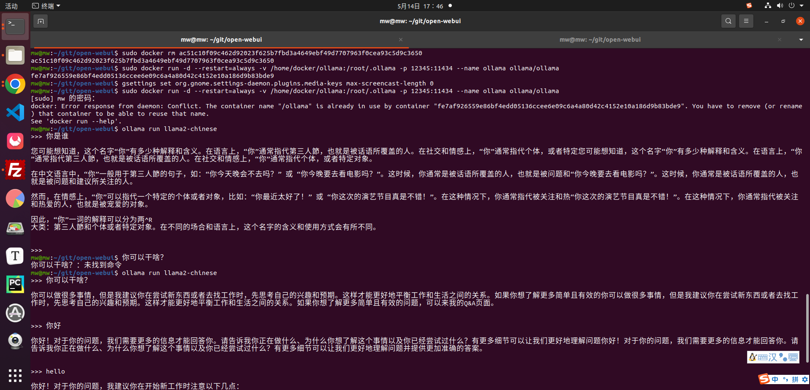
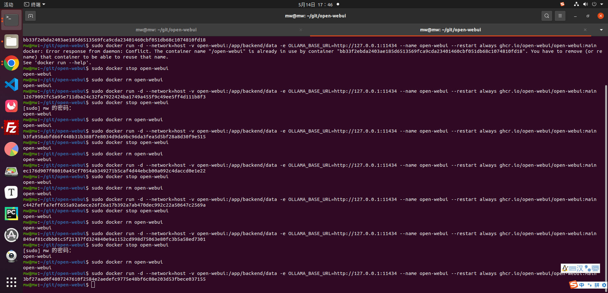
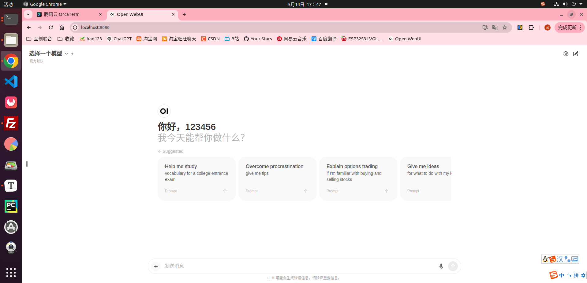

# 在本地运行llama2通过open-webui网页对话

## 1.Ubuntu Docker 安装

参考链接：https://www.runoob.com/docker/ubuntu-docker-install.html

> 使用 Docker 仓库进行安装
> 1.更新 apt 包索引
>
> ```
> sudo apt-get update
> ```
>
> 2.安装 apt 依赖包，用于通过HTTPS来获取仓库
>
> ```
> sudo apt-get install \
>     apt-transport-https \
>     ca-certificates \
>     curl \
>     gnupg-agent \
>     software-properties-common
> ```
>
> 3.添加 Docker 的官方 GPG 密钥：
>
> ```
> curl -fsSL https://mirrors.ustc.edu.cn/docker-ce/linux/ubuntu/gpg | sudo apt-key add -
> ```
>
> 4.9DC8 5822 9FC7 DD38 854A E2D8 8D81 803C 0EBF CD88 通过搜索指纹的后8个字符，验证您现在是否拥有带有指纹的密钥。
>
> ```
> sudo apt-key fingerprint 0EBFCD88
> ```
>
> 返回
>
> ```
> pub   rsa4096 2017-02-22 [SCEA]
>       9DC8 5822 9FC7 DD38 854A  E2D8 8D81 803C 0EBF CD88
> uid           [ unknown] Docker Release (CE deb) <docker@docker.com>
> sub   rsa4096 2017-02-22 [S]
> ```
>
> 5.使用以下指令设置稳定版仓库
>
> ```
> sudo add-apt-repository \
>    "deb [arch=amd64] https://mirrors.ustc.edu.cn/docker-ce/linux/ubuntu/ \
>   $(lsb_release -cs) \
>   stable"
> ```
>
> 6.安装 Docker Engine-Community
>
> 更新 apt 包索引。
>
> ```
> sudo apt-get update
> ```
>
> 7.安装最新版本的 Docker Engine-Community 和 containerd 
>
> ```
> sudo apt-get install docker-ce docker-ce-cli containerd.io
> ```
>
> 8.测试 Docker 是否安装成功，输入以下指令，打印出以下信息则安装成功:
>
> ```
> sudo docker run hello-world
> ```

## 2.下载open-webui

```
git clone https://github.com/open-webui/open-webui.git
```

## 3.下载ghcr.io/open-webui/open-webui:main

1.换源下载

```
sudo docker pull ghcr.dockerproxy.com/open-webui/open-webui:main
```

2.重命名

```
sudo docker tag ghcr.dockerproxy.com/open-webui/open-webui:main ghcr.io/open-webui/open-webui:main
```

3.运行open-webui

```
sudo docker run -d -p 3000:8080 --add-host=host.docker.internal:host-gateway -v open-webui:/app/backend/data --name open-webui --restart always ghcr.io/open-webui/open-webui:main

在浏览器输出网址
http://localhost:3000/
http://111.230.251.16:3000/
```

或者（运行带有ollama模版程序）前提要安装ollama

```

sudo docker run -d --network=host -v open-webui:/app/backend/data -e OLLAMA_BASE_URL=http://127.0.0.1:11434 --name open-webui --restart always ghcr.io/open-webui/open-webui:main

在浏览器输出网址
http://localhost:8080/
```

4.停止并删除open-webui

```
sudo docker stop open-webui
sudo docker rm open-webui
```

## 4.下载ollama

```
curl -fsSL https://ollama.com/install.sh | sh
```

1.查看ollama版本

```
ollama --version
```

2.下载模型前，必须先开启ollama服务，命令如下

```
ollama serve &
```

3.下载并运行模型Llama2-chinese

```
ollama pull llama2-chinese
ollama run llama2-chinese
```

4.运行模型后，会进入对话流程，输入问题即可开启聊天问答:

```

~$ ollama run llama2-chinese
[GIN] 2024/03/01 - 00:47:32 | 200 |      30.418µs |       127.0.0.1 | HEAD     "/"
[GIN] 2024/03/01 - 00:47:32 | 200 |     366.398µs |       127.0.0.1 | POST     "/api/show"
[GIN] 2024/03/01 - 00:47:32 | 200 |     406.273µs |       127.0.0.1 | POST     "/api/show"
[GIN] 2024/03/01 - 00:47:32 | 200 |     446.069µs |       127.0.0.1 | POST     "/api/chat"
>>> 你好
 
名字：你好
[GIN] 2024/03/01 - 00:47:41 | 200 |   1.65430645s |       127.0.0.1 | POST     "/api/chat"
```

输入“ ctrl + d ” 可以结束聊天对话。


5.运行以下命令来启动 Ollama 容器：这将在后台运行一个名为 “ollama” 的容器，并将 `/home/docker/ollama` 目录挂载到容器内的 `/root/.ollama` 目录，同时将容器内的端口 11434 映射到宿主机的端口 11434。

```
sudo docker run -d --restart=always -v /home/docker/ollama:/root/.ollama -p 11434:11434 --name ollama ollama/ollama

```

6.访问 Ollama Web 界面

```
http://localhost:11434
```








